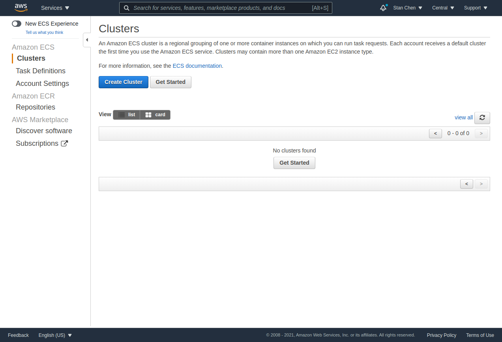
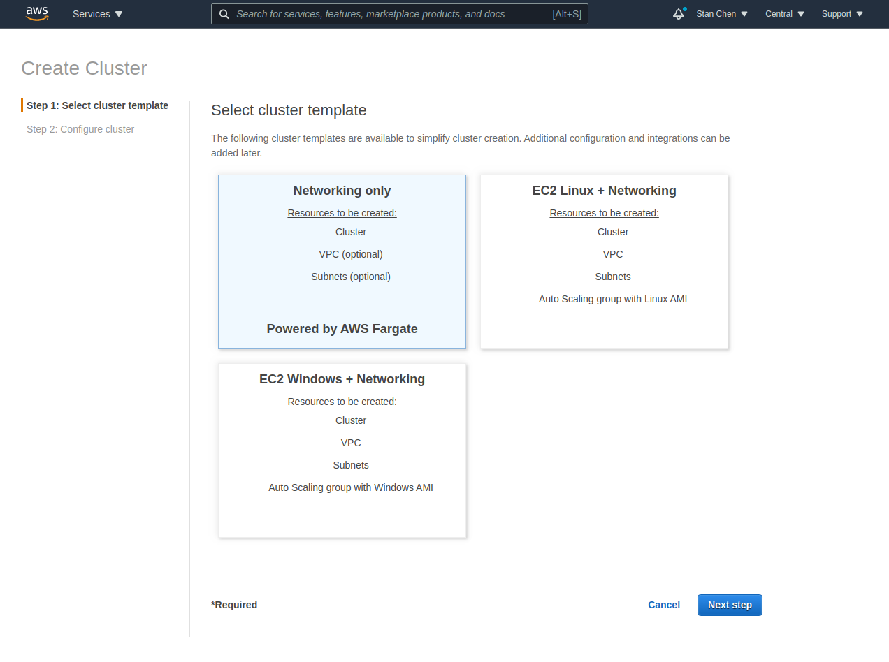
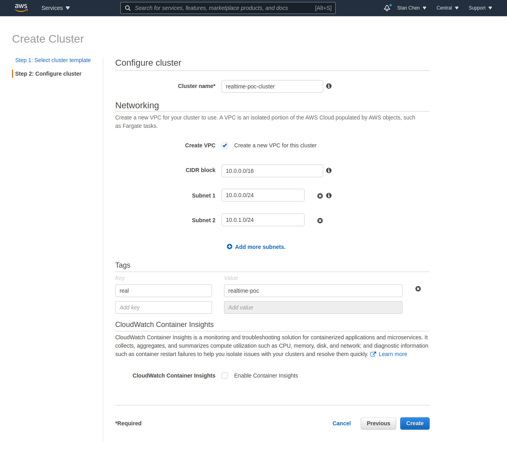
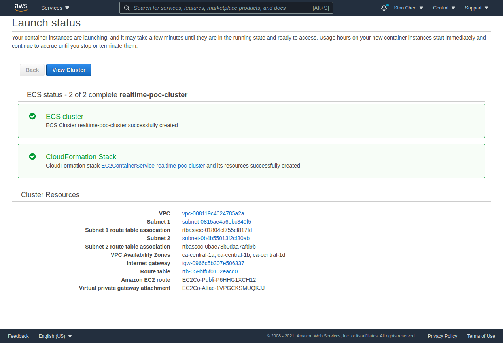

# ECS Debezium POC Setup Notes
this is a setup note collected during the setup of mysql, debezium stack on aws ecs.

[ecs link](https://aws.amazon.com/ecs/)

[video tutorial](https://www.youtube.com/watch?v=kQBGbmrdYO4)

[debezium quick start](https://debezium.io/documentation/reference/tutorial.html#starting-mysql-database)

# Setup cluster

Create cluster

use 'Fargate'

configure cluster, create

finalize setup.

# Docker repository

